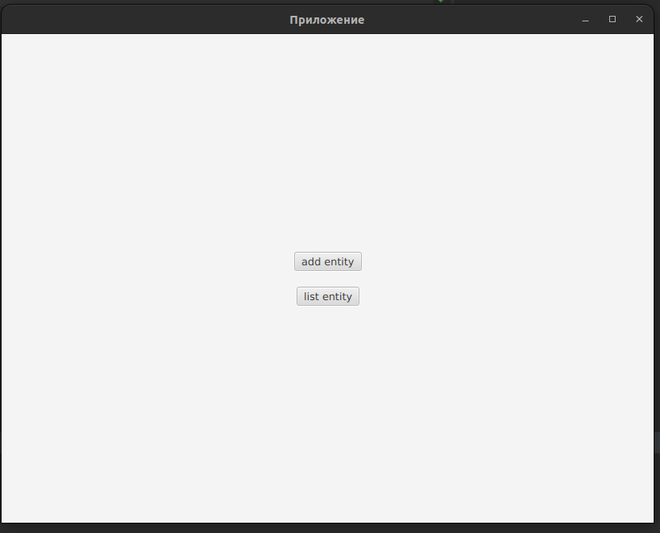
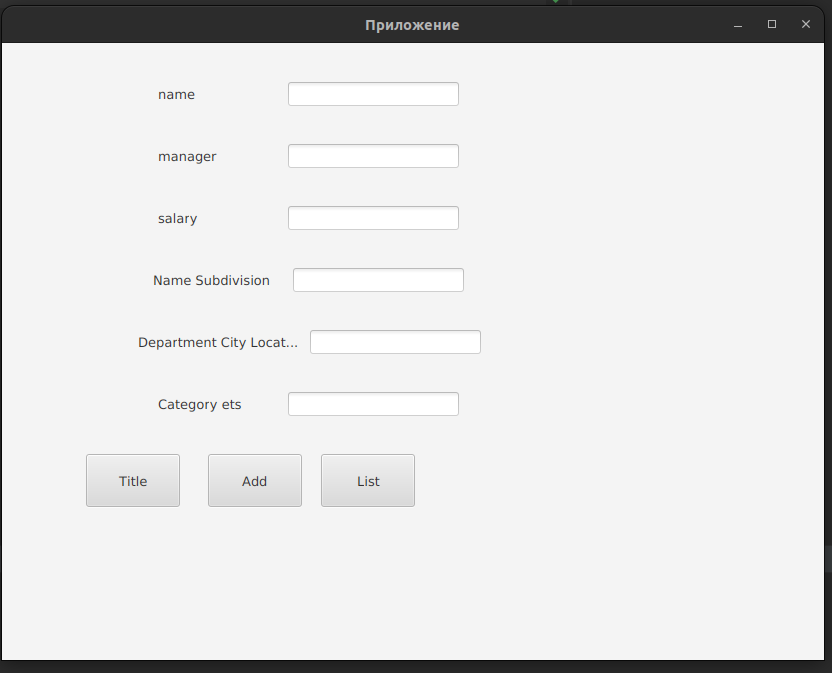
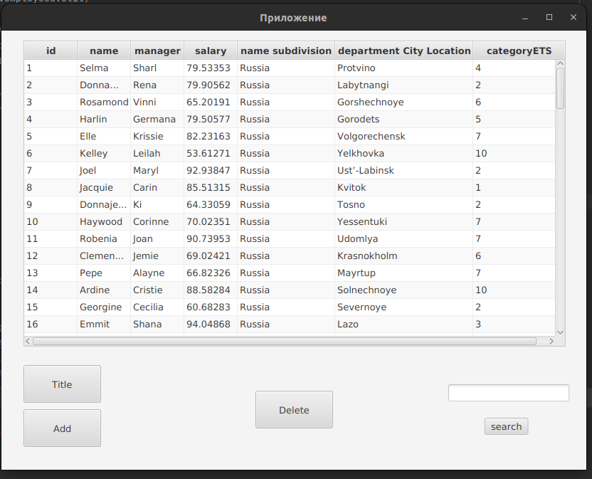

# Application lab 4 for PGUTI for PP

## Image application
### Title

### Add employee

### List employees and action delete, search employee

## Use technologist:
- java 11
- java FX
- JDBC

## To use the app

1) Создать БД и сущность (файл с запросом лежит в sql).
2) Заполнить сущность информацией, которая лежит в sql вторым файлом.
3) Подключится к бд через класс Util в scr (нужно написат: драйвер, url, логин и пароль от БД).
4) Запустить приложение.

## Problem

- threads
- not button "all list employees"